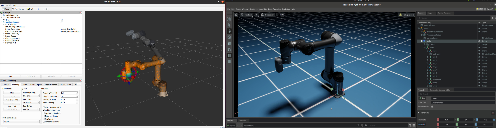
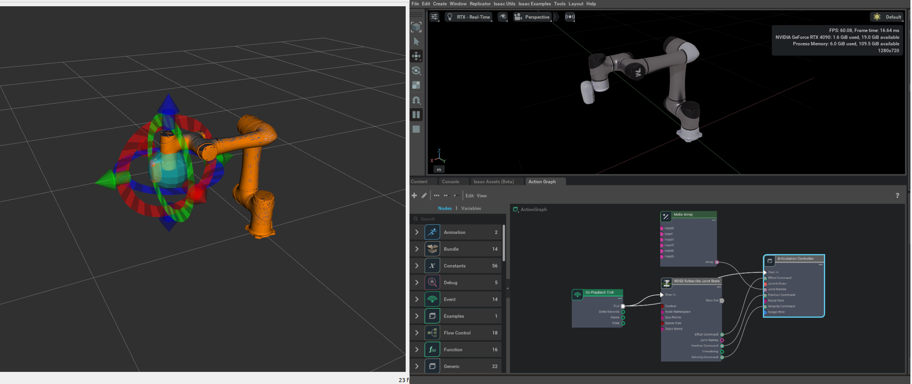

# Overview

This repository provides an example of synchronizing a **TM Robot** with **Isaac Sim**. Users can control the TM Robot externally via **Moveit** using the **TM ROS Driver** and synchronize its pose to Isaac Sim. Additionally, users can build their own simulation environment based on their specific needs. The provided robot USD serves as a component that can be imported for use.

## Requirements

- **TM ROS Driver (Humble)**
- **Isaac Sim 4.2.0**

### Installing the TM ROS Humble Driver

Install the driver according to the **TMflow** version of your TM Robot. For example, for **TMflow 2**:

https://github.com/TechmanRobotInc/tm2_ros2/tree/humble


- Installation:  
  [TM ROS Driver Installation Guide](https://github.com/TechmanRobotInc/tm2_ros2/tree/humble?tab=readme-ov-file#3-tm-ros-driver-usage-and-installation)

- For driver usage and controlling the robot with Moveit, refer to:  
  [TM ROS Driver Usage](https://github.com/TechmanRobotInc/tm2_ros2/blob/humble/doc/tm_humble_extension.md#related-projects-and-tutorials-usage)

### Installing Nvidia Isaac Sim

1. Install **Isaac Sim 4.2.0** according to Nvidia's official hardware requirements and download:
   - [System Requirements](https://docs.isaacsim.omniverse.nvidia.com/4.2.0/installation/requirements.html)
   - ~~[Installation Guide](https://docs.isaacsim.omniverse.nvidia.com/4.2.0/installation/install_workstation.html)~~ (Omniverse Launcher will be deprecated and will no longer be available starting October 1, 2025.)
   - [download](https://docs.isaacsim.omniverse.nvidia.com/latest/installation/download.html#download-isaac-sim-short)

   If installed via **Omniverse Launcher**, the default installation path is usually:
   ```bash
   ~/.local/share/ov/pkg/isaac-sim-4.2.0
   ```

## Quick Start

### Real Robot
1. Modify `tmros_setup.sh` to set the correct **TM ROS Driver** path and **Robot IP**.
2. Modify `run_demo.sh` to set your **Isaac Sim** path, then run:
   ```bash
   ./run_demo.sh
   ```

### Virtual Robot
1. Modify `tmros_setup.sh` to set the correct **TM ROS Driver** path.
2. Run `run_demo_virtual.sh` to launch the **virtual robot**:
   ```bash
   ./run_demo_virtual.sh
   ```
Now, you can control the **TM Robot** using **Moveit** and synchronize its pose to **Isaac Sim**.


## Other Method

You can also synchronize the robot's pose by using **OmniGraph** nodes to subscribe to **Joint States** from the `/joint_states` topic. For more details, refer to the isaac sim official tutorial:  
[Add Joint States in UI](https://docs.isaacsim.omniverse.nvidia.com/4.2.0/ros2_tutorials/tutorial_ros2_manipulation.html#add-joint-states-in-ui)

